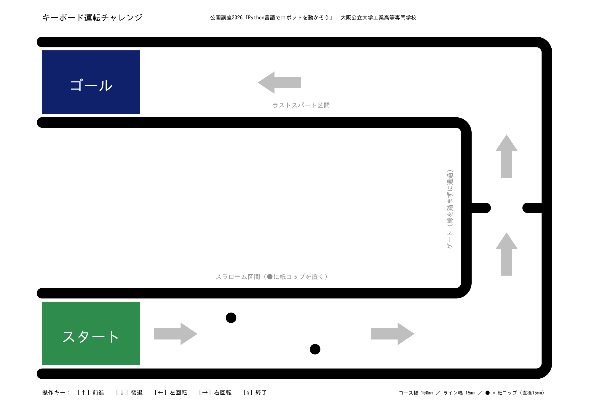

# 5. キーボード運転と運転チャレンジ

いよいよ今日のゴールです．**矢印キーでtoioを運転**できるようにします．

ここまでのプログラムは「書いた通りに勝手に動く」ものでした．これからは，**キーを押しているあいだだけ動く**プログラムを作ります．ラジコンのような感覚で運転できます．

---

## 完成版プログラム

次のプログラムを**まるごとコピー**して，Thonnyのエディタに貼り付けてください．長く見えますが，自分で書きかえるのは2〜3か所だけです．

貼り付けたら `drive.py` という名前で保存しましょう．

```python
from toio.simple import SimpleCube
from pynput import keyboard

# --- キーボード入力の管理（おまじない：変更しない） ---
current_keys = set()
should_exit = False

def on_press(key):
    global should_exit
    if hasattr(key, 'char') and key.char == 'q':
        should_exit = True
    current_keys.add(key)

def on_release(key):
    current_keys.discard(key)

listener = keyboard.Listener(on_press=on_press, on_release=on_release)
listener.start()

# --- ここから運転プログラム ---
target_cube_name = "toio-xxx"  # ←自分のキューブ名

MOVE_SPEED = 30   # ★カスタマイズポイント：前進スピード
SPIN_SPEED = 30   # ★カスタマイズポイント：回転スピード

with SimpleCube(name=target_cube_name) as cube:
    print("矢印キーで運転！ qで終了")
    while not should_exit:
        if keyboard.Key.up in current_keys:
            cube.move(MOVE_SPEED, 0)
        elif keyboard.Key.down in current_keys:
            cube.move(-MOVE_SPEED, 0)
        elif keyboard.Key.left in current_keys:
            cube.spin(-SPIN_SPEED, 0)
        elif keyboard.Key.right in current_keys:
            cube.spin(SPIN_SPEED, 0)
        else:
            cube.stop_motor()
        cube.sleep(0.01)

    cube.stop_motor()
    cube.turn_off_cube_lamp()

listener.stop()
print("おしまい")
```

---

## 動かし方

1. `target_cube_name` を**自分のキューブ名**に書きかえる
2. 緑の**Run（実行）**ボタンを押す
3. Shellに `矢印キーで運転！ qで終了` と出たら準備完了
4. **矢印キー**で運転する
5. やめるときは **q キー**を押す

| キー | 動き |
| --- | --- |
| ↑ | 前に進む |
| ↓ | 後ろにさがる |
| ← | 左に回る |
| → | 右に回る |
| q | プログラム終了 |

**動かないときは**：一度Thonnyの画面（Shell）をクリックしてから，矢印キーを押してください．

---

## 中身をちょっとだけ説明

**`while not should_exit:`**

`while`（ホワイル）は「〜のあいだ，ずっとくり返す」という命令です．`q` が押されるまで，中身をずっとくり返します．

**`if` ～ `elif` ～ `else`**

「もし↑が押されていたら前進，そうでなくて↓なら後退，…，どれも押されていなければ止まる」という意味です．キーを離すと `else` に入って止まります．

**`cube.move(MOVE_SPEED, 0)`**

秒数が `0` なので「止めろと言われるまで進み続ける」という意味です．だからキーを押しているあいだ走り続けます．

**`MOVE_SPEED` と `SPIN_SPEED`**

前のページで学んだ「変数」です．この数字を変えるだけで，運転の感じが変わります．

---

## やってみよう

**やってみよう1**: `MOVE_SPEED` を `15` や `60` に変えて運転してみましょう．どのくらいのスピードが自分にとって運転しやすいですか．

**やってみよう2**: 前進しているときだけLEDが光るようにしてみましょう．

<details markdown="1">
<summary>ヒント</summary>

`cube.move(MOVE_SPEED, 0)` の**次の行**に，同じ字下げで `cube.turn_on_cube_lamp(0, 255, 0, 0)` を追加します．消すには `else:` のところに `cube.turn_off_cube_lamp()` を追加します．

</details>

<details markdown="1">
<summary>答えの例（変える部分だけ）</summary>

```python
        if keyboard.Key.up in current_keys:
            cube.move(MOVE_SPEED, 0)
            cube.turn_on_cube_lamp(0, 255, 0, 0)   # 前進中は緑
        elif keyboard.Key.down in current_keys:
            cube.move(-MOVE_SPEED, 0)
        elif keyboard.Key.left in current_keys:
            cube.spin(-SPIN_SPEED, 0)
        elif keyboard.Key.right in current_keys:
            cube.spin(SPIN_SPEED, 0)
        else:
            cube.stop_motor()
            cube.turn_off_cube_lamp()              # 止まったら消す
```

</details>

---

# 運転チャレンジ

自分のプログラムでtoioを運転して，コースを走りきりましょう．

## コース

A1サイズのポスターがコースです．



[コース図PDF（A1・実寸印刷用）](files/toio_course_A1.pdf) … 印刷時は拡大縮小なし（100%）を指定してください．

1. **スタート（緑）** … ここからスタート
2. **スラローム** … 紙コップ2個のあいだをジグザグに通りぬける
3. **ゲート（幅6cm）** … せまい門を通りぬける
4. **ラストスパート** … まっすぐの直線
5. **ゴール（紺）** … ここに入ったらゴール

---

## ルール

- **ラインを踏んでもやり直しにはなりません．** スピードをゆるめて，コースに戻ればそのまま続行できます．
- **紙コップを倒してしまっても大丈夫です．** スタッフが起こしますので，そのまま続けてください．
- まずは**完走**をめざしましょう．最後まで走りきれたら**完走賞**です．
- 完走できて余裕がある人は，**タイム計測**に挑戦しましょう．

あせらなくて大丈夫です．ゆっくり確実に走らせた方が，結果的に速いことがよくあります．

---

## カスタマイズ課題

チャレンジの前に，自分の運転しやすいように**プログラムを調整**しておきましょう．

**課題1：スピードの調整**

`MOVE_SPEED` と `SPIN_SPEED` を変えて，コースを走りやすい値を見つけましょう．

- せまいゲートを通るには，**遅め**（15〜25）が有利
- 直線のラストスパートは，**速め**（50〜80）が有利
- 回転のスピードは，前進とは別に調整できます

**課題2：前進中にLEDを光らせる**

上の「やってみよう2」でつくったLEDを光らせるプログラムを使うと，前に進んでいるかどうかが目で見てわかるようになります．自分の好きな色にしてみましょう．

---

## まとめ

今日は，

- `print` と変数と `for` でPythonの基本を学び，
- LEDを光らせてtoioとつながり，
- `move` `spin` `run_motor` でロボットを走らせ，
- キーボードで運転するプログラムを完成させました．

プログラミングは「書きかえて，動かして，たしかめる」のくり返しです．今日やったことは，まさにそのくり返しでした．

もっとやってみたい人は，[トップページの「もっとやりたい人へ」](index.html#もっとやりたい人へ)から，音・センサー・位置制御などのページに進んでみてください．

**今日はおつかれさまでした．**
